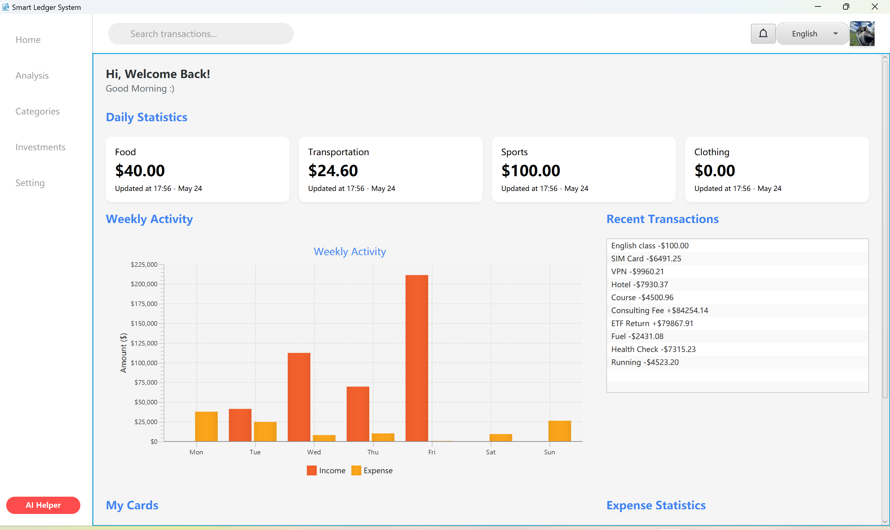

# EBU6304 SoftwareProject Group 16

This is a Java-based financial management desktop application developed using JavaFX and Maven. This project supports expense tracking, budgeting, category analysis, and intelligent recommendations.

## 📦 Project Structure
```
.
├── src/                                # Java source code (main application)
│ ├── main/
│ │ ├── java/com.shelton.ebu6403/       # Main logic: controllers, models
│ │ ├── resources/com.shelton.ebu6403/  # FXML, images, styles
│ ├── test/                             # JUnit test files
│ │ ├── java/com.shelton.ebu6403.models/
├── JunitTest/                          # Additional controller-level tests
├── data/                               # Application data (CSV files)
├── pom.xml                             # Maven project configuration
├── README.md                           # Project documentation
```

## 🧰 Technologies
- Java JDK 21
- JavaFX
- Maven
- JUnit 5
- JavaFX Charts

## Before Start (🛠️ Maven Installation)
This project uses [Apache Maven](https://maven.apache.org/) to build and run the application.  
Please ensure that Maven is installed on your system before running the commands below.

### 🔗 How to Install Maven

1. Download Maven from the official site:  
   👉 https://maven.apache.org/download.cgi

2. Follow the step-by-step installation guide:  
   👉 https://maven.apache.org/install.html

3. After installation, open your terminal or command prompt and run:

   ```bash
   mvn -v
   ```

## 🚀 Getting Started

### 1. Clone the repository (Or download ZIP)
```bash
git clone https://github.com/jhr419/LedgerEase.git
```
After cloning, you can run the following command to verify that the project folder has been successfully created:
```bash
ls -l LedgerEase
```
If you see the full project directory structure (e.g., src, pom.xml, etc.), it means the clone was successful. Then:
```bash
cd LedgerEase
```

### 2. Build the project with Maven

```bash
mvn clean install
```

### 3. Run the application

#### 📌 Option 1: Using Maven on Command Line

Ensure JavaFX is configured and run the application with:

```bash
mvn javafx:run
```

#### 📌 Option 2: Using IntelliJ IDEA 

1. Open the project in **IntelliJ IDEA**.
2. Make sure the JavaFX SDK is configured.
3. Navigate to `src/main/java/com/shelton/ebu6403/LedgerApp.java`.
4. Right-click `LedgerApp` → `Run 'LedgerApp.main()'`.

> ⚠️ Make sure JavaFX is configured in your environment. If using IntelliJ IDEA, enable JavaFX SDK under Project Structure.

## 🔐 Default Login Account

To help you get started quickly, a default login account is provided:

- **Username:** `BUPT`
- **Password:** `BUPT`

Please use this account to log in when you launch the application for the first time or create a new account.

> ⚠️ Note: Remember to change or disable the default account before deploying the application in a production environment.

## 🧪 Running Tests

To run all unit tests:

```bash
mvn test
```

## 📁 Sample Data Format

Example of an **input CSV**  file in `data/` which you want to import directly :
```csv
serialNo,name,date,amount
1,Rent,2025-04-01,1500.00
2,Internet Bill,2025-04-05,60.00
3,Coffee,2025-04-07,15.50
```

## 📚 Documentation

This project is documented using **Javadoc**.

To view the full API documentation:

1. Navigate to the `javadoc` folder in this project
2. Open `index.html` with any web browser

> 📂 Path: `javadoc/index.html`


## ✨ Features

- Expense and income tracking
- Budget setting and visualization
- Holiday-based spending reminders
- Intelligent categorization using AI
- Clean JavaFX UI with data charts

## 📸 Screenshots
If you run the code successfully, the home page can be seen as follows.



## 👥 Team Contributions
| Member Name  | Role / Contribution                                                                                 |
|--------------|-----------------------------------------------------------------------------------------------------|
| Zuhao Zhang  | Developed JUnit tests and implemented the savings module                                            |
| Zhifei Liu   | Implemented AI-based classification and report generation, budget setup                             |
| Haihan Sun   | Built expense CRUD logic and investment module, chart demonstration                                 |
| Weicheng Xie | Designed and structured the MVC architecture, implemented GUI rendering                             |
| Jia Liu      | Maintained and updated the prototype regularly, developed the Analysis page                         |
| Haoran Jin   | Created Home and Categories page interfaces, and developed the login and registration functionality |

🔧 All members participated in debugging, UI polishing, and final presentation preparation.


## 📝 License

This project is part of BUPT/QMUL EBU6304 Software Engineering Coursework. For academic use only.


